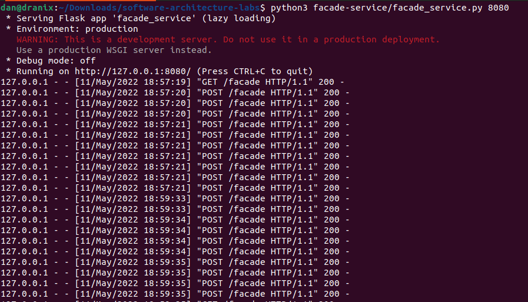
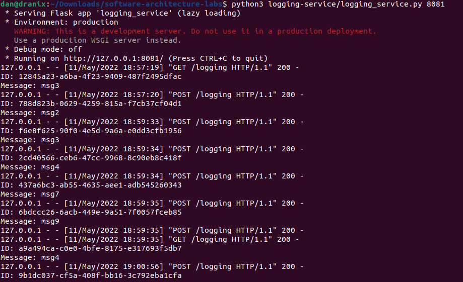
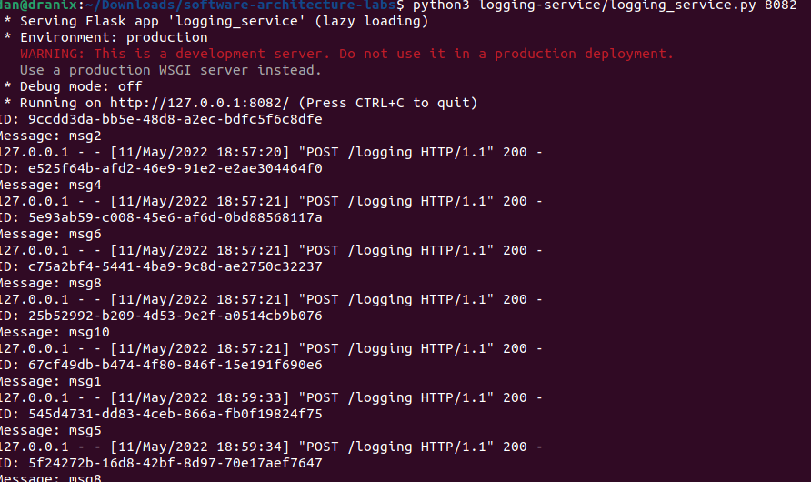
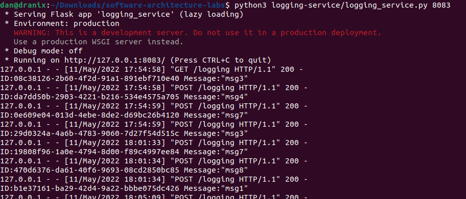
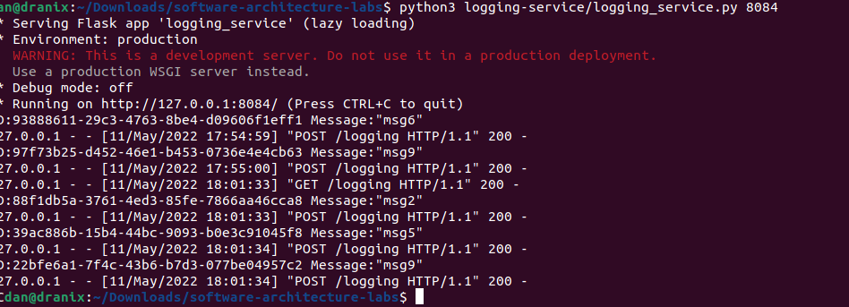
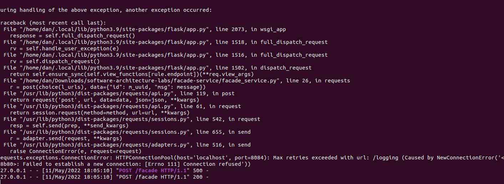

# Homework 3

## Requirements

```shell
pip3 install -r requirements.txt
```

## Usage

Run 1 facade, 1 messaging, 3 logging services and execute HTTP file

```shell
python3 facade-service/facade_service.py 8080
python3 messages-service/messages_service.py 8081
python3 logging-service/logging_service.py 8082
python3 logging-service/logging_service.py 8083
python3 logging-service/logging_service.py 8084
```

## Comments







After stopping 1 logging service, we start getting errors both in python console and http requests

