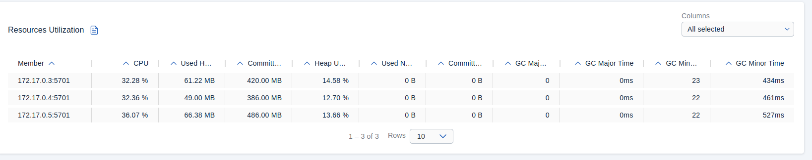
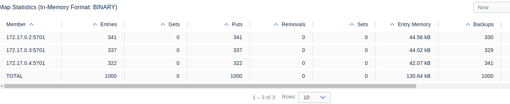
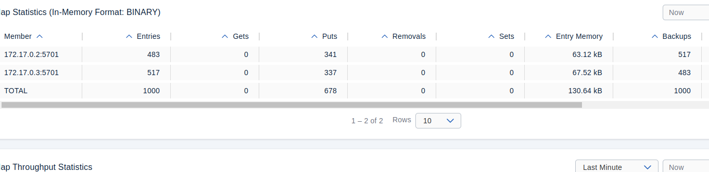
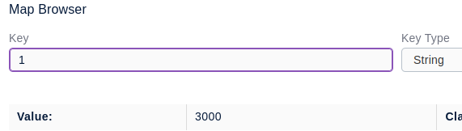

# Lab 2: Hazelcast Basics

## Requirments:

```
pip install -r requirements.txt
```

## Results

### Task 1

Hazelcast installed

### Task 2 



### Task 3

Distributed Map with 3 nodes:



After deleting 1 of the nodes: 



### Task 4

Without locking:


Optimistic locking:


Pessimistic locking:



### Task 5

The bounding of queue must be made using .xml file.

If there is no reading and the queue is filled, the writer will wait until the queue is popped.

During reading from 2 clients, there were no data races, and all the values were properly read and printed.
