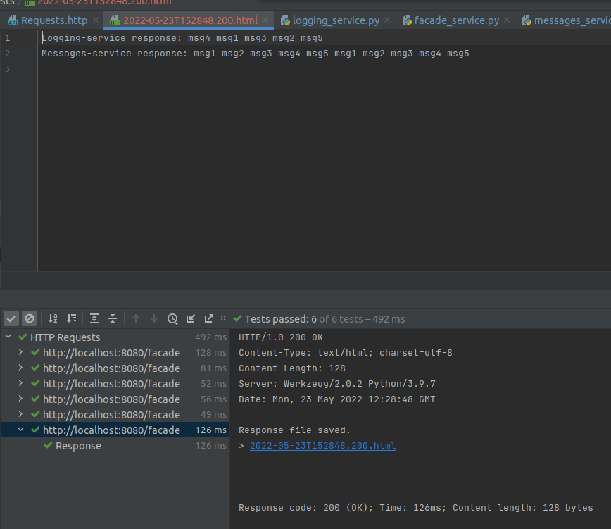
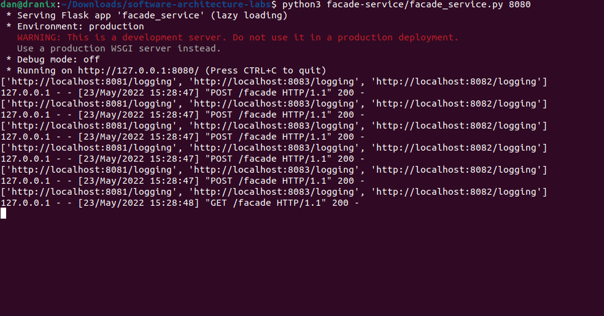
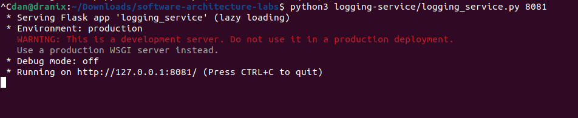
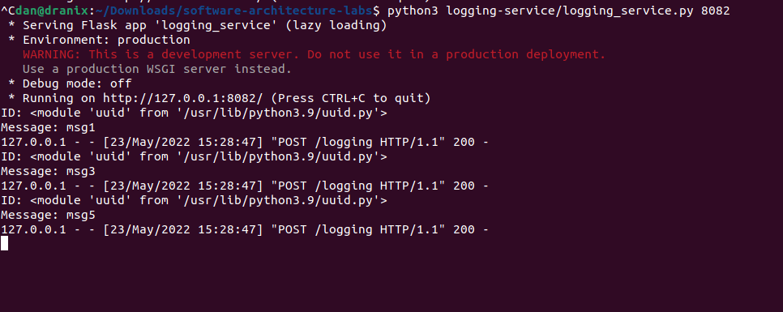
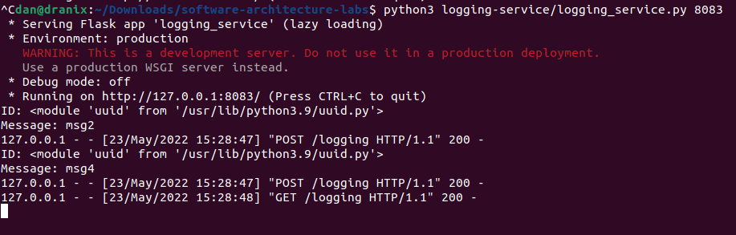
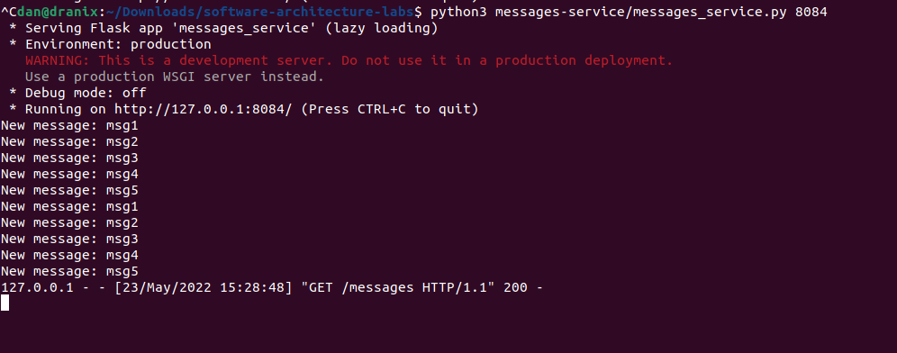
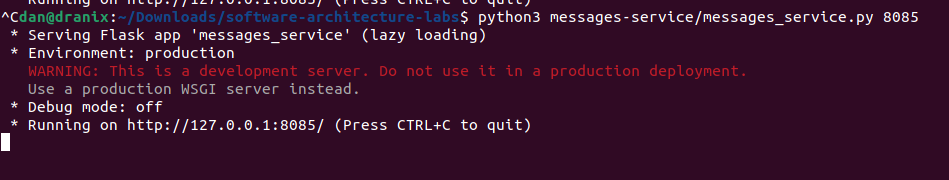

# Homework 4

## Requirements

```shell
pip3 install -r requirements.txt
```

## Usage

Run 3 instances of Hazelcast node

```shell
hazelcast-5.1.1/bin/hz start  # 3 times
```

Run consul with the script (give x permission before that)
```shell
chmod +x ./scripts/*.sh
./scripts/run-consul.sh
```

Run 1 facade, 2 messaging, 3 logging services and execute HTTP file in PyCharm

```shell
python3 facade-service/facade_service.py 8080
python3 logging-service/logging_service.py 8081
python3 logging-service/logging_service.py 8082
python3 logging-service/logging_service.py 8083
python3 messages-service/messages_service.py 8084
python3 messages-service/messages_service.py 8085
```

Stop consul with 
```shell
./scripts/shutdown-consul.sh
```

## Images
The get response





I still don't know why only first message service gets everything


